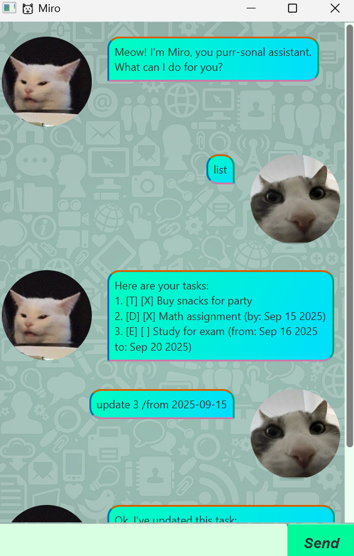

# Miro Chatbot

Miro is a friendly, interactive desktop assistant that helps you manage your tasks using a simple GUI.  

It supports adding, listing, marking, and deleting tasks, with support for deadlines and events.

 <!-- Add your screenshot to docs/screenshots/miro_gui.png -->

## Features

- Add tasks: To-dos, deadlines, and events
- Mark tasks as done or undone
- Delete tasks
- List all tasks
- Search for tasks by keyword

## Getting Started

### Prerequisites

- Java 11 or above
- JavaFX SDK

### Setup

1. Clone this repository.
2. Ensure JavaFX is set up in your IDE or build system.
3. Run the `Main` class in `miro.gui`.

### Example Usage

#### Add a To-do


```
todo Read book
```
Output:
```
Purr-fect! I've added this task:
[T][ ] Read book

Now you have 1 task.
```

#### Add a Deadline

Type:
```
deadline Submit assignment /by 2025-09-15
```
Output:
```
Purr-fect! I've added this task:
[D][ ] Submit assignment (by: 15 Sept 2025)

Now you have 2 tasks.
```

#### Add an Event

Type:
```
event Study for exam /from 2025-09-15 /to 2025-09-22 
```
Output:
```
Purr-fect! I've added this task:
[E][ ] Study for exam (from: 15 Sept 2025 to 22 Sept 2025)

Now you have 3 tasks.
```

#### List Tasks

Type:
```
list
```
Output:
```
Here are your tasks:
1. [T][ ] Read book
2. [D][ ] Submit assignment (by: 15 Sept 2025)
3. [E][ ] Study for exam (from: 15 Sept 2025 to 22 Sept 2025)
```

#### Mark Task as Done

Type:
```
mark 1
```
Output:
```
Nice! I've marked this task as done:
[T][X] Read book
```

#### Update a Task
Type:
```
update 3 /from 2025-09-16
```
Output:
```
Noted. I've updated this task:
[E][ ] Study for exam (from: 16 Sept 2025 to 22 Sept 2025)
```

If you type an invalid command, Miro will highlight the error in the dialog box to catch your attention.

#### Delete a Task

Type:
```
delete 2
```
Expected output:
```
Noted. I've removed this task:
[D][ ] Submit assignment (by: 15 Sept 2025)
```